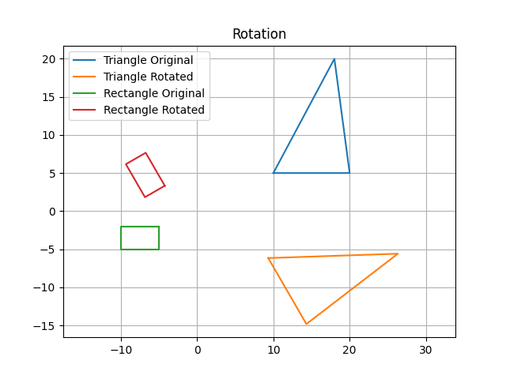
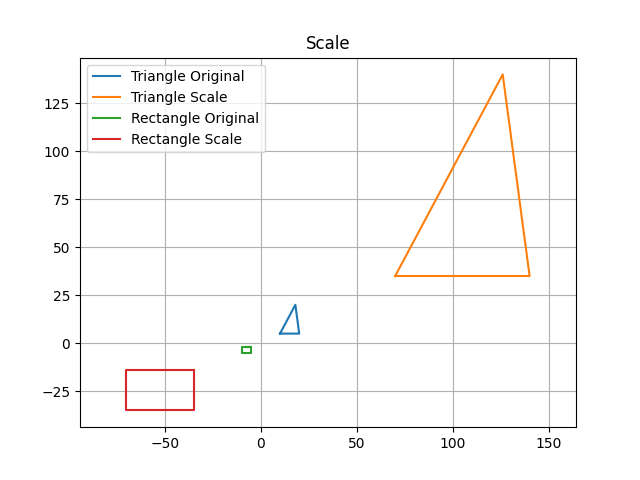
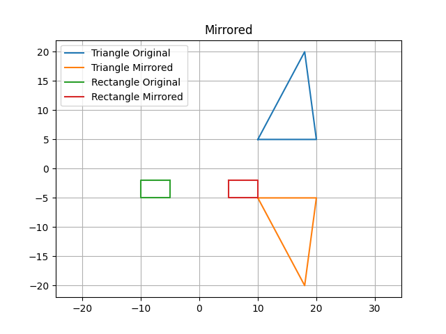
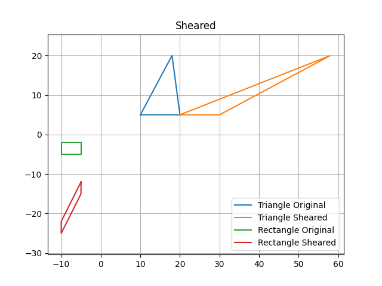
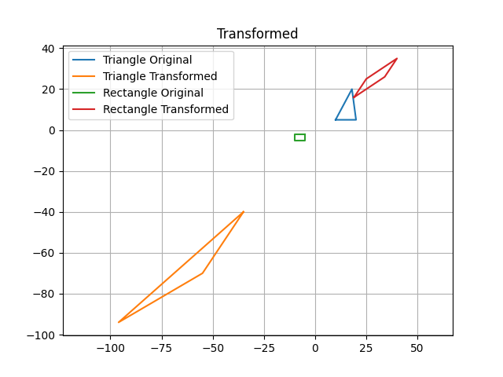

# Part1
Apply matrices to achieve linear transformations. 

Supported transformations: 
- rotations
- scale
- mirror
- shear
- arbitrary transformation

## Some matrices & results

### Rotation
<pre> 
 [[cos, -sin],
  [sin,  cos ]]

</pre>

### Scale
<pre> 
 [[scale_factor, 0],
  [0, scale_factor]]

</pre>

### Mirror
<pre> 
Mirrored by 'X':
 [[1, 0],
  [0, -1]]

Mirrored by 'Y':
[[-1, 0],
 [0, 1]]
</pre>

### Shear
<pre> 
Sheared by 'X':
 [[1, shear_factor],
  [0, 1]]

Sheared by 'Y':
[[1, 0],
 [shear_factor, 1]]
</pre>

### Arbitrary Transformation
<pre>

[[a11, a12], 
 [a21, a22]]

</pre>

