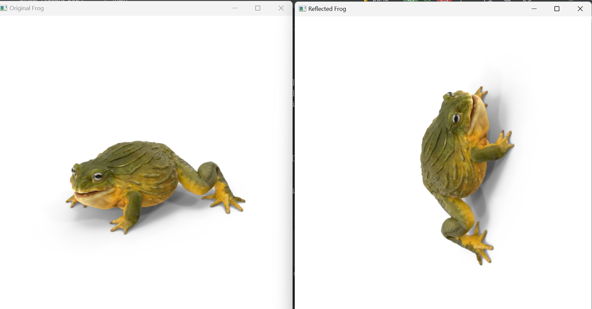

# Part1
Apply matrices to achieve linear transformations. 

Supported transformations: 
- rotations
- scale
- mirror
- shear
- arbitrary transformation

## Some matrices & results

### Rotation
<pre> 
 [[cos, -sin],
  [sin,  cos ]]

</pre>

### Scale
<pre> 
 [[scale_factor, 0],
  [0, scale_factor]]

</pre>

### Mirror
<pre> 
Mirrored by 'X':
 [[1, 0],
  [0, -1]]

Mirrored by 'Y':
[[-1, 0],
 [0, 1]]
</pre>

### Shear
<pre> 
Sheared by 'X':
 [[1, shear_factor],
  [0, 1]]

Sheared by 'Y':
[[1, 0],
 [shear_factor, 1]]
</pre>

### Arbitrary Transformation
<pre>

[[a11, a12], 
 [a21, a22]]

</pre>

# Part2

Supported transformations: 
- rotations
- scale
- reflection
- shear
- arbitrary transformation

## Some matrices & results

### Rotation
<pre> 
[[cos(x), -sin(x), ((1 - cos(x)) * cx) - (sin(x) * cy)],
 [sin(x), cos(x), (sin(x) * cx) - ((1 - cos(x)) * cy)]]

</pre>

Where:
  - center = (picture_width // 2, picture_height // 2)
  - cx = center[0]
  - cy = center[1]

scale_factor is assumed to be 1.

### Scaling
<pre> 
[[scale_factor, 0, (1 - scale_factor) * cx],
 [0, scale_factor, - ((1 - scale_factor) * cy)]]

</pre>

Where:
  - center = (picture_width // 2, picture_height // 2)
  - cx = center[0]
  - cy = center[1]

angle is assumed to be  0.
Taking into account that cos(0) = 1  &&  sin(0) = 1.

### Reflection
<pre>

[[0, 1, 0],
 [1, 0, 0]]

</pre>

For x = y

### Shear
<pre>
    if axis == 'x':
        [[1., shear_factor, 0.],
         [0., 1., 0.]]

    if axis == 'y':
        [[1., 0., 0.],
         [shear_factor, 1., 0.]]

</pre>

### Arbitrary Transformation

For arbitrary transformed we can use any matrix in the following format:
<pre>
[[a11, a12, a13],
 [a21, a22, a23]]
</pre>

## Random Image (Frog)

For this part reflection was chosen.

